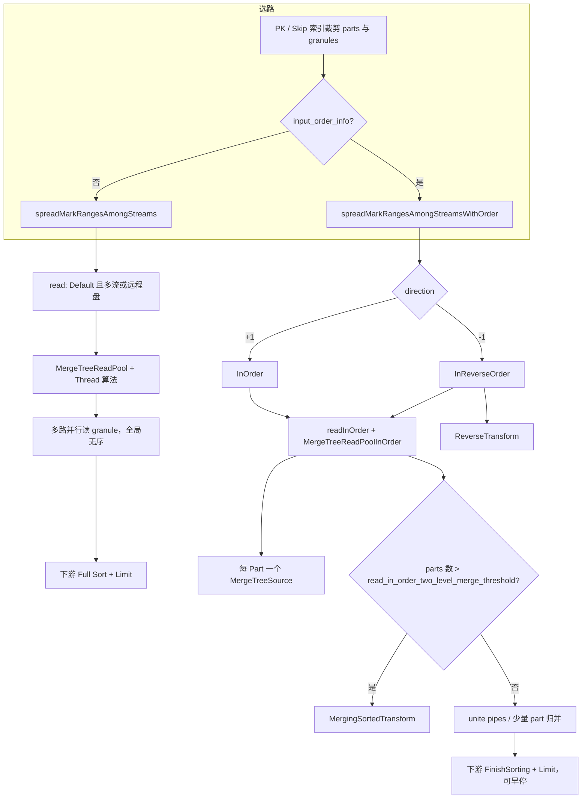

# MergeTree 三种读方式：Default / InOrder / InReverseOrder

本文档说明 ClickHouse MergeTree 在查询执行时如何选择 **三种读类型**（`MergeTreeReadType`），以及它们在源码中的差异与验证方法。基于当前仓库（26.2）源码整理。

---

## 1. 枚举定义

定义位置：`src/Storages/MergeTree/MergeTreeReadTask.h`

```cpp
enum class MergeTreeReadType : uint8_t
{
    /// 默认：MergeTreeReadPool，多流并行，按 mark 分任务，不保证全局排序键顺序
    Default,

    /// 按排序键顺序读；输出 port 数通常等于 part 数；num_streams 在此被忽略
    InOrder,

    /// 同 InOrder，但 part 内从后向前读 mark，并加 ReverseTransform
    InReverseOrder,

    /// 并行副本专用（本文不展开）
    ParallelReplicas,
};
```

EXPLAIN 中的 `ReadType: Default | InOrder | InReverseOrder` 由 `ReadFromMergeTree::readTypeToString()` 输出（`ReadFromMergeTree.cpp`）。

---

## 2. 何时选用哪一种？

### 2.1 分叉点

`ReadFromMergeTree` 在 PK / Skip 索引裁剪出 `parts_with_ranges` 之后：

| 条件 | 调用路径 | 结果 ReadType |
|------|----------|---------------|
| `query_info.input_order_info == nullptr` | `spreadMarkRangesAmongStreams()` | **Default** |
| `query_info.input_order_info != nullptr` | `spreadMarkRangesAmongStreamsWithOrder()` | **InOrder** 或 **InReverseOrder** |

对应源码（约 3048–3059 行）：

```cpp
if (query_info.input_order_info)
    return spreadMarkRangesAmongStreamsWithOrder(..., query_info.input_order_info);
return spreadMarkRangesAmongStreams(...);
```

### 2.2 `input_order_info` 如何产生

- Setting：`optimize_read_in_order`（默认 `1`），计划层还有 `query_plan_read_in_order`。
- 优化器：`ReadInOrderOptimizer`（`InterpreterSelectQuery` / `optimizeReadInOrder.cpp`）。
- 条件概要：
  - `ORDER BY`（或部分 `GROUP BY` 场景）与表 **排序键前缀** 一致；
  - 不与 `FINAL`、部分复杂子句组合（见官方 [ORDER BY 数据读取优化](https://clickhouse.com/docs/sql-reference/statements/select/order-by#optimization-of-data-reading)）。
- 启用后调用 `ReadFromMergeTree::requestReadingInOrder(prefix_size, direction, read_limit)`。

`InputOrderInfo`（`src/Storages/SelectQueryInfo.h`）关键字段：

| 字段 | 含义 |
|------|------|
| `used_prefix_of_sorting_key_size` | 已按存储序排列的排序键前缀列数 |
| `direction` | `+1` → InOrder（ASC 同向），`-1` → InReverseOrder（反向） |
| `limit` | 无 WHERE 时可将 `LIMIT+OFFSET` 下推到读阶段（`getLimitForSorting`） |
| `sort_description_for_merging` | 多路有序流归并时的 SortDescription |

```cpp
// requestReadingInOrder 内（约 2818–2820 行）
analyzed_result_ptr->read_type = (query_info.input_order_info->direction > 0)
    ? ReadType::InOrder
    : ReadType::InReverseOrder;
```

**注意**：`FINAL` + 反向 in-order 时 `requestReadingInOrder` 会返回 `false`（约 2795–2798 行），退回普通读。

---

## 3. 执行路径总览



### 3.1 `read()` 内二次路由

`ReadFromMergeTree::read()`（约 803–847 行）：

| read_type | 条件 | 实际读池 |
|-----------|------|----------|
| `ParallelReplicas` | 并行副本 | `readFromPoolParallelReplicas` |
| `Default` | `max_streams > 1` 或全远程盘 | `readFromPool` → **MergeTreeReadPool** |
| `Default` | 单流 + 本地 | `readInOrder(..., Default, limit=0)`，必要时 **ConcatProcessor** |
| `InOrder` / `InReverseOrder` | 始终 | `readInOrder` → **MergeTreeReadPoolInOrder** |

---

## 4. 三种方式对照表

| 维度 | **Default** | **InOrder** | **InReverseOrder** |
|------|-------------|-------------|---------------------|
| **触发** | 无 `input_order_info` | `direction > 0` | `direction < 0` |
| **读池** | `MergeTreeReadPool`（任务可 steal） | `MergeTreeReadPoolInOrder` | 同 InOrder |
| **`preservesOrderOfRanges()`** | `false` | `true` | `true` |
| **Select 算法** | `MergeTreeThreadSelectAlgorithm` | `MergeTreeInOrderSelectAlgorithm` | `MergeTreeInReverseOrderSelectAlgorithm` |
| **并行** | `num_streams` 路，mark 在 part 间均衡 | 通常 **每 part 一路** | 同 InOrder |
| **Part 内 mark 顺序** | 各线程任意 | **从前向后** | **从后向前** |
| **小 LIMIT** | 无 `input_order_info.limit` 早停 | `has_limit_below_one_block`：每次 task 常只取 **一个** mark range | 同左，range 从尾部取 |
| **`reader_settings.read_in_order`** | `false` | `true` | `true` |
| **管道尾部** | 多流无序；单流可能 Concat | 多 part 时 `MergingSorted`；可选 VirtualRow | 同 InOrder + **`ReverseTransform`** |
| **典型 ORDER BY LIMIT** | 全表读 + Full Sort | 按序读 + FinishSorting + 早停 | 同 InOrder，方向相反 |
| **Reverse 额外** | — | 直接 `task.read()` 输出 | 先缓冲多个 chunk 再 LIFO 输出 + 行级 Reverse |

---

## 5. Default（默认并行读）

### 5.1 行为

- **入口**：`spreadMarkRangesAmongStreams` → `read(..., ReadType::Default, num_streams, ...)`。
- **`MergeTreeReadPool::getTask`**：按线程在多个 part 的 mark 上切分/窃取任务，**不保证**全局排序键顺序。
- 适合：无 read-in-order 优化，或 `ORDER BY` 与存储序不一致。

### 5.2 实测表现（demo_pk_order，1000 万行）

```text
SETTINGS optimize_read_in_order = 0
Processed 10.00 million rows, 80.00 MB
Elapsed ~0.032 s
```

EXPLAIN：`ReadType: Default`，Sorting 为全量 `Sort description`（非 Prefix/Result 一致）。

---

## 6. InOrder（按排序键正向读）

### 6.1 行为

- **入口**：`spreadMarkRangesAmongStreamsWithOrder`，`read_type = InOrder`（`direction == 1`）。
- **读池**：`MergeTreeReadPoolInOrder`，`getTask` 在 `has_limit_below_one_block` 时每次只取 **一个** mark range（从前端 pop）。
- **Mark 切分**（`split_ranges`，direction=1）：从 range **头部** 按 `max_block_size` 拆 granule，便于小 LIMIT 少读。
- **多 part**：`parts.size() > read_in_order_two_level_merge_threshold`（默认 100）时加 `MergingSortedTransform`；part 较少时直接多路 merge/unite。
- **下游**：常与 `FinishSorting`（EXPLAIN 中 `Prefix sort description` = `Result sort description`）配合，而非全量排序。

### 6.2 相关 Settings

| Setting | 默认 | 作用 |
|---------|------|------|
| `optimize_read_in_order` | 1 | 总开关 |
| `query_plan_read_in_order` | 1 | 计划层优化 |
| `read_in_order_use_buffering` | 1 | 归并前缓冲 |
| `read_in_order_two_level_merge_threshold` | 100 | 多 part 预归并阈值 |
| `read_in_order_use_virtual_row` | 0 | 虚拟行优化（多 part PK） |

### 6.3 实测表现（demo_pk_order）

```text
SETTINGS optimize_read_in_order = 1
ORDER BY a ASC, b ASC LIMIT 10
Processed 32.77 thousand rows, 262.14 KB
Elapsed ~0.006 s
```

约 **4 parts × 8192 行/granule ≈ 32768** 行：每 part 读第一个 granule 做全局 Top 10 归并后停止。

EXPLAIN：`ReadType: InOrder`，`Granules: 1222/1222` 为 **规划上界**，不等于运行时读满 1222 个 granule。

---

## 7. InReverseOrder（按排序键反向读）

### 7.1 与 InOrder 的共用与差异

**共用**：`readInOrder` + `MergeTreeReadPoolInOrder` + 每 part 一个 `MergeTreeSource`。

**差异**：

1. **`getTask`**：从 `all_mark_ranges` **尾部** pop range（`MergeTreeReadPoolInOrder.cpp`）。
2. **`split_ranges`**（direction≠1）：从 range **末端** 切 granule（注释：反向需整段在内存中反转，切分更细）。
3. **`MergeTreeInReverseOrderSelectAlgorithm`**：读完一个 task 的多个 chunk 压栈，再 LIFO 输出。
4. **管道**：`readInOrder` 返回的 pipe 上增加 **`ReverseTransform`**（块内行倒序）。

### 7.2 验证 EXPLAIN

```sql
EXPLAIN actions = 1, indexes = 1
SELECT a, b FROM demo_pk_order
ORDER BY a DESC, b DESC
LIMIT 10
SETTINGS optimize_read_in_order = 1;
-- 期望：ReadType: InReverseOrder，且计划中出现 ReverseTransform
```

---

## 8. 与 ORDER BY + LIMIT 其它优化的关系

| 优化 | 与三种 ReadType 的关系 |
|------|------------------------|
| **LIMIT 下推到 Sorting** | `tryPushDownLimit`：Limit → Sorting 时 `updateLimit`；三种读类型下游都可能有 Sorting+Limit |
| **TopK（skip index / 动态过滤）** | `tryOptimizeTopK`：针对 `ORDER BY 单列 LIMIT`，与 InOrder 路径独立，需单独开 setting |
| **Lazy materialization** | `query_plan_optimize_lazy_materialization`：可与 InOrder 叠加 |
| **分布式 LIMIT** | `distributed_push_down_limit`：shard 级 LIMIT，与本地 ReadType 正交 |

---

## 9. 验证 SQL 脚本

### 9.1 建表与灌数（示例）

```sql
DROP TABLE IF EXISTS demo_pk_order;

CREATE TABLE demo_pk_order
(
    a UInt32,
    b UInt32,
    payload String DEFAULT ''
)
ENGINE = MergeTree
ORDER BY (a, b)
SETTINGS index_granularity = 8192;

-- 示例：1000 万行
INSERT INTO demo_pk_order
SELECT
    intDiv(number, 100) AS a,
    number % 100 AS b,
    ''
FROM numbers(10000000);
```

### 9.2 三种 ReadType 对比

```sql
-- InOrder
EXPLAIN actions = 1, indexes = 1
SELECT a, b FROM demo_pk_order ORDER BY a ASC, b ASC LIMIT 10
SETTINGS optimize_read_in_order = 1;

SELECT a, b FROM demo_pk_order ORDER BY a ASC, b ASC LIMIT 10
SETTINGS optimize_read_in_order = 1;

-- InReverseOrder
EXPLAIN actions = 1, indexes = 1
SELECT a, b FROM demo_pk_order ORDER BY a DESC, b DESC LIMIT 10
SETTINGS optimize_read_in_order = 1;

-- Default
EXPLAIN actions = 1, indexes = 1
SELECT a, b FROM demo_pk_order ORDER BY a ASC, b ASC LIMIT 10
SETTINGS optimize_read_in_order = 0;

SELECT a, b FROM demo_pk_order ORDER BY a ASC, b ASC LIMIT 10
SETTINGS optimize_read_in_order = 0;
```

### 9.3 用 query_log 看真实读行数

```sql
SET log_queries = 1;

SELECT a, b FROM demo_pk_order ORDER BY a, b LIMIT 10
SETTINGS optimize_read_in_order = 1 FORMAT Null;

SELECT a, b FROM demo_pk_order ORDER BY a, b LIMIT 10
SETTINGS optimize_read_in_order = 0 FORMAT Null;

SELECT
    query_id,
    Settings['optimize_read_in_order'] AS rio,
    read_rows,
    result_rows,
    query_duration_ms
FROM system.query_log
WHERE type = 'QueryFinish'
  AND query LIKE '%demo_pk_order%'
  AND query NOT LIKE '%system.query_log%'
ORDER BY event_time DESC
LIMIT 5;
```

### 9.4 EXPLAIN 自检表

| 检查项 | InOrder | InReverseOrder | Default |
|--------|---------|----------------|---------|
| `ReadType` | `InOrder` | `InReverseOrder` | `Default` |
| Sorting | `Prefix` = `Result` | 同左 | 仅 `Sort description` |
| ReverseTransform | 无 | 有 | 无 |
| 客户端 Processed rows（小 LIMIT） | 远小于表总行数 | 同量级 | 接近全表 |

---

## 10. 关键源码索引

| 主题 | 文件 | 说明 |
|------|------|------|
| 枚举 | `src/Storages/MergeTree/MergeTreeReadTask.h` | `MergeTreeReadType` |
| 选路 | `src/Processors/QueryPlan/ReadFromMergeTree.cpp` | `spreadMarkRanges*`、`read()`、`requestReadingInOrder` |
| InOrder 池 | `src/Storages/MergeTree/MergeTreeReadPoolInOrder.cpp` | `getTask`、limit 单 range |
| Default 池 | `src/Storages/MergeTree/MergeTreeReadPool.cpp` | 并行 steal |
| 选择算法 | `src/Storages/MergeTree/MergeTreeSelectAlgorithms.cpp` | Reverse 缓冲 |
| 优化器 | `src/Storages/ReadInOrderOptimizer.cpp` | `getInputOrder` |
| 解释器 | `src/Interpreters/InterpreterSelectQuery.cpp` | `optimize_read_in_order`、`getLimitForSorting` |
| 计划优化 | `src/Processors/QueryPlan/Optimizations/optimizeReadInOrder.cpp` | `query_plan_read_in_order` |
| LIMIT 下推 | `src/Processors/QueryPlan/Optimizations/limitPushDown.cpp` | Sorting `updateLimit` |
| 输入序信息 | `src/Storages/SelectQueryInfo.h` | `InputOrderInfo` |
| 官方测试 | `tests/queries/0_stateless/00940_order_by_read_in_order.sql` | read in order |

---

## 11. 常见问题

**Q：EXPLAIN 里 Granules 相同，是否说明没优化？**  
A：否。Granules 是索引裁剪后的 **可读上界**；InOrder + LIMIT 的早停发生在 **执行阶段**（`getTask` 逐 range、下游 Limit 取消），应看 `Processed rows` 或 `system.query_log.read_rows`。

**Q：为什么关 optimize_read_in_order 仍可能很快？**  
A：数据在 page cache、列很少、或比较的是 EXPLAIN 耗时而非 SELECT。

**Q：多 part 时 InOrder 读多少行？**  
A：常与 `part 数 × 首 granule 行数` 同量级；全局 LIMIT 需在多路有序流归并后确定，未必只读 1 个 granule。

---

## 12. 修订记录

| 日期 | 说明 |
|------|------|
| 2026-06-02 | 初版：整合 Default / InOrder / InReverseOrder 源码说明与 demo_pk_order 实测 |
