# Text 索引：写入与查询

基于 ClickHouse 26.2 源码（`MergeTreeIndexText.h/cpp`、`MergeTreeDataPartWriterOnDisk.cpp`、`MergeTreeDataSelectExecutor.cpp`、`MergeTreeReaderTextIndex.cpp`）整理。

Text 索引是一种 **倒排 skip index**：对 part 内行做分词，为每个 token 维护 posting list（行号集合），序列化到 **3 个文件**（`.idx` / `.dct` / `.pst`）；查询时用倒排与 PK mark 行区间求交做裁剪。

---

## 1. 整体写入流程

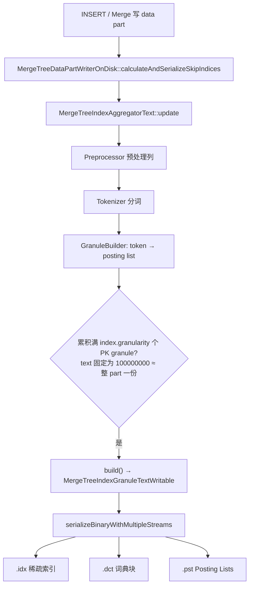

### 核心代码路径

**Part 写入时触发 skip index 计算**（`MergeTreeDataPartWriterOnDisk.cpp`）：

```cpp
void MergeTreeDataPartWriterOnDisk::calculateAndSerializeSkipIndices(...)
{
    ...
    if (skip_index_accumulated_marks[i] == index_helper->index.granularity)
    {
        auto index_granule = skip_indices_aggregators[i]->getGranuleAndReset();
        index_granule->serializeBinaryWithMultipleStreams(index_streams);
        ...
    }
    ...
    skip_indices_aggregators[i]->update(skip_indexes_block, &pos, granule.rows_to_write);
}
```

**内存中构建倒排表**（`MergeTreeIndexText.cpp`）：

```cpp
void MergeTreeIndexTextGranuleBuilder::addDocument(std::string_view document)
{
    forEachTokenPadded(*tokenizer, document.data(), document.size(),
        [&](const char * token_start, size_t token_length)
        {
            ...
            posting_list_builder.add(static_cast<UInt32>(current_row), posting_lists);
        });
}
```

### 源码注释摘要

`MergeTreeIndexText.h` 中的设计说明：

- Text index 是 skip index，在 granule 内对**所有文档**计算，内部用行号做 posting。
- **`GRANULARITY` 对 text 无效**：解析时被强制为 `100000000`（`DEFAULT_TEXT_INDEX_GRANULARITY`），等价于「整 part 一份倒排」。
- Merge 时 text index **可以合并**（`MergeTextIndexesTask`），不必每次重建。

```cpp
// Parsers/ASTIndexDeclaration.cpp
/// Text index is always built for the whole part and granularity is ignored.
if (type && type->name == "text")
    return ASTIndexDeclaration::DEFAULT_TEXT_INDEX_GRANULARITY;  // 100'000'000
```

---

## 2. 落盘文件：3 个数据流 + 3 个 marks

```cpp
// MergeTreeIndexText::getSubstreams()
{
    {Regular,              "",   ".idx"},   // 稀疏索引
    {TextIndexDictionary,  ".dct", ".idx"}, // 词典块
    {TextIndexPostings,    ".pst", ".idx"}  // Posting Lists
}
```

以 `INDEX idx_tags tags TYPE text(tokenizer = 'array')` 为例，data part 目录下会有：

```
all_1_1_0/
├── skp_idx_idx_tags.idx       ← 稀疏索引（token → .dct 偏移）
├── skp_idx_idx_tags.idx.mrk2  ← .idx 的 mark
├── skp_idx_idx_tags.dct       ← 词典块（token + posting 元信息）
├── skp_idx_idx_tags.dct.mrk2
├── skp_idx_idx_tags.pst       ← 大 posting list 的 Roaring Bitmap
└── skp_idx_idx_tags.pst.mrk2
```

索引文件名前缀为 `skp_idx_`（`MergeTreeIndices.cpp` 中 `INDEX_FILE_PREFIX`）。

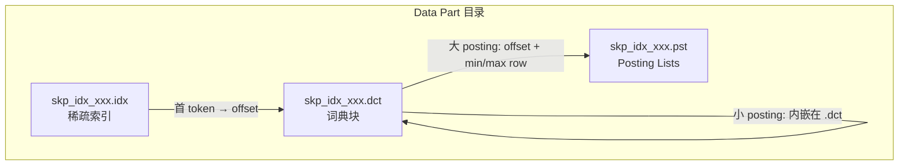

| 文件 | 内容 |
|------|------|
| `.idx` | 稀疏索引：每个 dictionary block 的**首 token** → 该 block 在 `.dct` 中的文件偏移 |
| `.dct` | 词典块：token 列表 + 每个 token 的 posting 元信息；小 posting 直接内嵌 |
| `.pst` | 大 posting list：Roaring Bitmap 或 raw VarUInt 行号（按 block 切分） |

`.idx` 和 `.dct` 走压缩写缓冲；`.pst` **不走** write buffer 压缩（posting 构建时已隐式压缩）。

---

## 3. 内存构建：倒排表

Text 索引是**倒排索引**。Posting list 存的是 **skip index granule 内的行号**（0-based），不是全局行号。

### 举例

```sql
CREATE TABLE demo (
    id UInt64,
    tags Array(String),
    INDEX idx_tags tags TYPE text(tokenizer = 'array')  -- GRANULARITY 会被强制为 100000000
) ENGINE = MergeTree
ORDER BY id
SETTINGS index_granularity = 4;  -- 4 行 = 1 个 PK mark；text 倒排覆盖整个 part

INSERT INTO demo VALUES
(0, ['api','web']),
(1, ['batch']),
(2, ['api']),
(3, ['canary']);
```

`tokenizer='array'` 时，每个 array 元素就是一个 token（不再切分）。

内存中的倒排表：

| token | posting list（granule 内行号） | cardinality |
|-------|----------------------------------|-------------|
| `api` | {0, 2} | 2 |
| `web` | {0} | 1 |
| `batch` | {1} | 1 |
| `canary` | {3} | 1 |

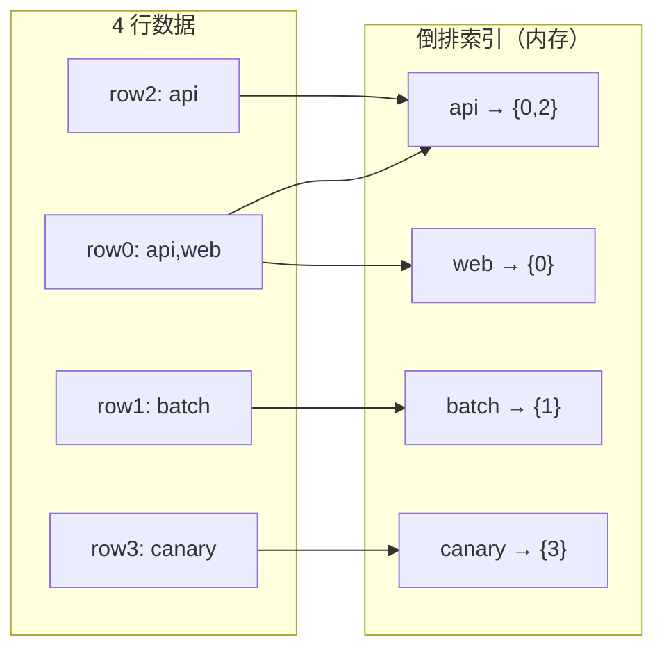

### Array(String) 列的写入逻辑

对 `Array(String)` 列，每行先遍历所有元素调用 `addDocument`，再 `incrementCurrentRow()`：

```cpp
if (isArray(index_column.type))
{
    for (size_t i = offset; i < offset + rows_read; ++i)
    {
        for (size_t element_idx = column_offsets[i - 1]; element_idx < column_offsets[i]; ++element_idx)
        {
            granule_builder.addDocument(ref);  // 每个 array 元素
        }
        granule_builder.incrementCurrentRow();
    }
}
```

对普通 `String` 列，整行作为一个 document，由 tokenizer（如 `splitByNonAlpha`）切词。

---

## 4. `addDocument` 做了什么：往哪些内存结构写

`addDocument` 是倒排表的**单文档写入入口**。它不落盘，只更新 `MergeTreeIndexTextGranuleBuilder` 里的内存结构。真正写 `.idx/.dct/.pst` 发生在后续 `build()` → `serializeBinaryWithMultipleStreams`。

### 4.1 源码逐步拆解

```cpp
void MergeTreeIndexTextGranuleBuilder::addDocument(std::string_view document)
{
    forEachTokenPadded(
        *tokenizer,
        document.data(),
        document.size(),
        [&](const char * token_start, size_t token_length)
        {
            bool inserted;
            TokenToPostingsBuilderMap::LookupResult it;

            // ① 把 token 字符串拷进 arena，作为 hashmap 的 key
            ArenaKeyHolder key_holder{std::string_view(token_start, token_length), *arena};
            tokens_map.emplace(key_holder, it, inserted);

            // ② 取出该 token 的 PostingListBuilder，写入当前行号
            auto & posting_list_builder = it->getMapped();
            posting_list_builder.add(static_cast<UInt32>(current_row), posting_lists);

            // ③ 统计处理过的 token 次数（含重复 token）
            ++num_processed_tokens;
            return false;  // false = 继续切下一个 token
        });
}
```

| 步骤 | 动作 | 写入的内存结构 |
|------|------|----------------|
| ① 分词 | `forEachTokenPadded` 用 tokenizer 切出每个 token | 只读 `document`，不写结构 |
| ② 存 key | `ArenaKeyHolder` 把 token 字节拷到 arena | **`arena`** |
| ③ 建/查映射 | `tokens_map.emplace`：新 token 插入，已有则复用 | **`tokens_map`**（`StringHashMap<PostingListBuilder>`） |
| ④ 写行号 | `posting_list_builder.add(current_row, posting_lists)` | **`PostingListBuilder`**（small 数组）或 **`posting_lists`**（Roaring） |
| ⑤ 计数 | `++num_processed_tokens` | **`num_processed_tokens`** |

注意：`addDocument` **不推进行号**。行号由外层 `incrementCurrentRow()` 在处理完该行所有 document 后才 `++current_row`。

### 4.2 GranuleBuilder 的内存结构总览

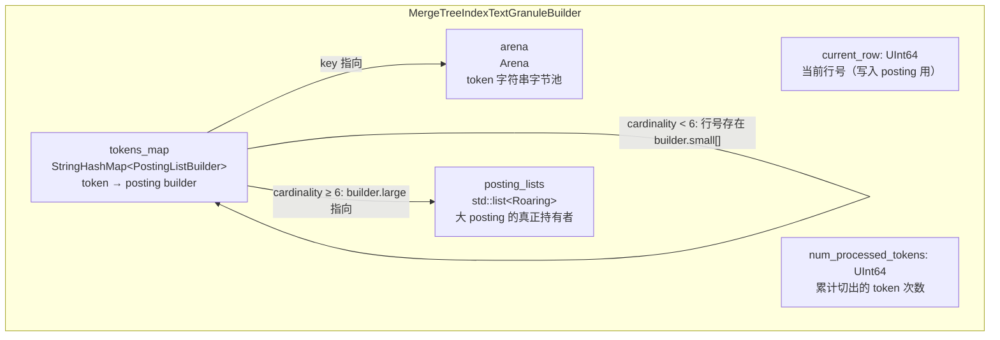

各结构职责：

| 成员 | 类型 | 作用 |
|------|------|------|
| `current_row` | `UInt64` | 当前正在索引的行号（granule 内 0-based） |
| `num_processed_tokens` | `UInt64` | 累计 token 出现次数（同一 token 多行会多次 +1） |
| `tokens_map` | `StringHashMap<PostingListBuilder>` | 倒排主表：token → posting builder |
| `posting_lists` | `std::list<PostingList>`（即 `list<Roaring>`） | 仅当某 token 行号 ≥ 6 时，Roaring 对象挂在这里；用 `list` 保证指针稳定 |
| `arena` | `Arena` | 存放 token 字符串副本，hashmap key 指向这里，避免反复分配 |

`PostingListBuilder` 本身是 **union 优化**：

```
PostingListBuilder（约 24 字节）
├─ small_size < 6  →  small[6]：栈上 UInt32 数组存行号
└─ small_size ≥ 6  →  large.postings → posting_lists 里的 Roaring
                      large.context  → BulkContext（加速连续插入）
```

### 4.3 示例：逐步看内存怎么变

沿用前面的 4 行数据，`tokenizer = 'array'`，`current_row` 从 0 开始。

#### 初始状态

```
current_row = 0
tokens_map  = {}
posting_lists = []
arena = (空)
num_processed_tokens = 0
```

#### 处理 row0：`addDocument("api")` 然后 `addDocument("web")`

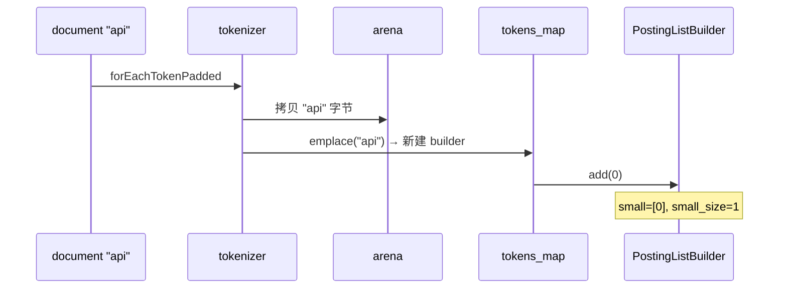

处理完 row0 两个 token 后：

```
current_row = 0  （尚未 increment）
arena: ["api", "web"]
tokens_map:
  "api" → PostingListBuilder{ small=[0], size=1 }
  "web" → PostingListBuilder{ small=[0], size=1 }
posting_lists: []   ← 还没人升级到 Roaring
num_processed_tokens = 2
```

然后外层调用 `incrementCurrentRow()` → `current_row = 1`。

#### 处理 row1：`addDocument("batch")` → increment → row2：`addDocument("api")`

第二次遇到 `"api"` 时：

1. `tokens_map.emplace` 发现 key 已存在（`inserted=false`）
2. **不往 arena 再拷一份**（复用已有 key）
3. 对该 builder 再 `add(2)` → `small=[0, 2]`

```
current_row = 2（处理完 row2 后会变成 3）
arena: ["api", "web", "batch"]
tokens_map:
  "api"    → small=[0, 2], size=2
  "web"    → small=[0],    size=1
  "batch"  → small=[1],    size=1
posting_lists: []
num_processed_tokens = 4
```

#### 处理 row3：`addDocument("canary")` 后最终内存态

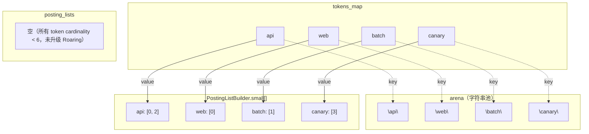

### 4.4 何时写入 `posting_lists`（small → Roaring）

假设同一个 granule 里 `"api"` 出现在行号 `0,1,2,3,4,5`（第 6 次插入时 `small_size` 达到 `max_small_size=6`）：

```cpp
// PostingListBuilder::add 关键逻辑
small[small_size++] = value;
if (small_size == max_small_size)  // == 6
{
    large.postings = &postings_holder.emplace_back();  // 在 posting_lists 新建 Roaring
    for (i = 0..5) large.postings->addBulk(..., small_copy[i]);
}
// 之后再 add() 都走 large.postings->addBulk
```

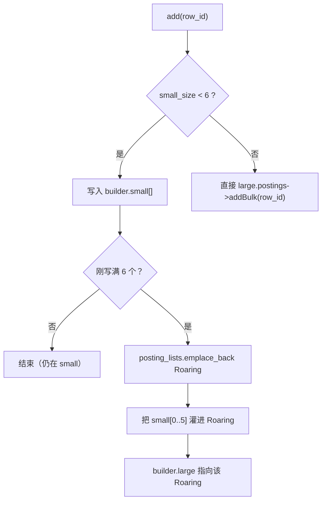

升级后内存关系：

```
tokens_map["api"].large.postings ──► posting_lists 中的某个 Roaring{0,1,2,3,4,5,...}
tokens_map["web"].small = [0]     ──► 仍在 builder 内部，不占 posting_lists
```

### 4.5 和后续 `build()` 的衔接

`addDocument` 只维护无序 hashmap。`build()` 时才会：

1. 遍历 `tokens_map`，收集 `(token_view, PostingListBuilder*)` 到 `SortedTokensAndPostings`
2. **按 token 字典序排序**
3. 把 `tokens_map / posting_lists / arena` 所有权移入 `MergeTreeIndexGranuleTextWritable`
4. 之后序列化才写 `.idx / .dct / .pst`

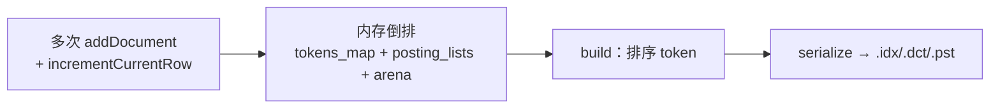

### 4.6 小结

| 问题 | 答案 |
|------|------|
| `addDocument` 写磁盘吗？ | **不写**，只更新内存 |
| token 字符串存在哪？ | **`arena`** |
| token → posting 映射在哪？ | **`tokens_map`** |
| 行号存在哪？ | 少见 token：`PostingListBuilder.small[]`；多见 token：`posting_lists` 里的 Roaring |
| 行号从哪来？ | 成员 **`current_row`**（由 `incrementCurrentRow` 推进，不是 `addDocument` 推进） |
| 同一行同一 token 写两次？ | `add()` 发现与上一个值相同会 **直接 return**（去重） |

---

## 5. 序列化：3 个文件各写什么

### Step 1：token 排序 + 切 dictionary block

1. 所有 token 按字典序排序（上例：`api, batch, canary, web`）。
2. 按 `dictionary_block_size`（默认 **512**）切成多个 dictionary block。
3. 本例 4 个 token → **1 个 dictionary block**。

### Step 2：写 `.dct`（词典块）

每个 dictionary block 的二进制布局：

```
┌─ Dictionary Block ─────────────────────────────────────┐
│ tokens_format (VarUInt)          // 0=raw, 1=front-coded │
│ num_tokens (VarUInt)                                     │
│ tokens[] (ColumnString 序列化)                           │
│ 对每个 token:                                            │
│   header (VarUInt)     // Raw/Embedded/SingleBlock...  │
│   cardinality (VarUInt)                                  │
│   [offsets + row ranges] 或 [内嵌 posting]             │
└──────────────────────────────────────────────────────────┘
```

其中 `tokens_format` 由参数 `dictionary_block_frontcoding_compression` 决定（默认 `1` → FrontCoded）：

```cpp
auto tokens_format = params.dictionary_block_frontcoding_compression
    ? TextIndexSerialization::TokensFormat::FrontCodedStrings  // 1
    : TextIndexSerialization::TokensFormat::RawStrings;         // 0

// serializeTokensImpl
writeVarUInt(static_cast<UInt64>(format), ostr);  // 先写 format
writeVarUInt(num_tokens_in_block, ostr);          // 再写 token 数
switch (format) {
    case RawStrings:         serializeTokensRaw(...); break;
    case FrontCodedStrings:  serializeTokensFrontCoding(...); break;
}
```

### Step 2.1：两种 token 序列化的区别

| | `RawStrings` (0) | `FrontCodedStrings` (1，默认) |
|--|------------------|-------------------------------|
| 参数 | `dictionary_block_frontcoding_compression = 0` | `= 1` |
| 思路 | 每个 token 完整写出 | 利用**已排序** token 的公共前缀，只写后缀 |
| 每个 token 写什么 | `len` + 完整字节 | 首 token：`len` + 完整字节；后续：`lcp` + `suffix_len` + 后缀字节 |
| 空间 | 无压缩，体积大 | 前缀重复多时更省（如 `host.ip` / `host.name`） |
| 读取 | 直接按 `SerializationString` 读 | 需用前一个 token 还原：`prev[0..lcp) + suffix` |
| 适用 | 调试、token 几乎无公共前缀 | 生产默认；词典块内 token 已字典序排序 |

#### RawStrings：完整存储

```cpp
// serializeTokensRaw
for each token:
    writeVarUInt(token.size());
    write(token.data(), token.size());
```

假设 block 内已排序 token：`apple`, `apply`, `apricot`：

```
┌─ RawStrings ─────────────────────────────────────┐
│ len=5 "apple" │ len=5 "apply" │ len=7 "apricot" │
└──────────────────────────────────────────────────┘
写出字节（示意）： 5 apple | 5 apply | 7 apricot
```

#### FrontCodedStrings：前缀编码

```cpp
// serializeTokensFrontCoding
// 第一个 token：完整写出
writeVarUInt(first.size()); write(first);

// 后续 token：只写与前一个的公共前缀长度 + 剩余后缀
for each next token:
    lcp = commonPrefixLength(previous, current);
    writeVarUInt(lcp);
    writeVarUInt(current.size() - lcp);
    write(current.data() + lcp, current.size() - lcp);
```

同一组 token（逐字符比公共前缀，遇到第一个不同字符就停）：

```
apple  vs apply   : a-p-p-l | e≠y  → LCP=4 ("appl")，后缀 = "y"
apply  vs apricot : a-p | p≠r     → LCP=2 ("ap")，  后缀 = "ricot"
```

注意：LCP 是 **与前一个已还原 token** 比，不是与 block 首 token 比。
`apply` 和 `apricot` 第三个字符是 `p` vs `r`，所以公共前缀是 `ap`，不是 `apr`。

```
┌─ FrontCodedStrings ──────────────────────────────────────────┐
│ [完整] len=5 "apple"                                         │
│ [相对] lcp=4, suffix_len=1, "y"       → "appl" + "y" = apply │
│ [相对] lcp=2, suffix_len=5, "ricot"   → "ap" + "ricot" = apricot │
└──────────────────────────────────────────────────────────────┘
```

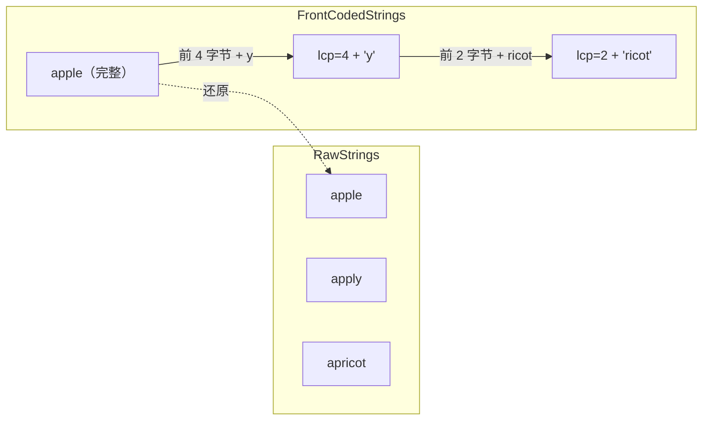

#### 为何 Front Coding 有效

Dictionary block 内 token **已按字典序排序**，相邻 token 往往共享前缀（如 `api` / `app`，`host.ip` / `host.name`）。Front coding 只存差分，读时顺序扫描 block 即可还原；稀疏索引仍用每个 block 的**首 token 完整串**做二分定位，不受 front coding 影响。

读路径对应 `deserializeTokensRaw` / `deserializeTokensFrontCoding`：后者按 `lcp` 从上一 token 拷贝前缀，再拼后缀。

---

### Step 3：`serializePostings` 流程，以及如何影响 `.dct` 写入

每个 token 在 `serializeTokensAndPostings` 里按固定三步处理：

```cpp
// 对 dictionary block 内每个 token：
auto token_info = serializePostings(postings, postings_stream, ...);  // ① 决策 + 可能写 .pst
serializeTokenInfo(dictionary_stream, token_info);                    // ② 写元信息到 .dct
if (token_info.header & EmbeddedPostings)
    PostingsSerialization::serialize(..., dictionary_stream);         // ③ 仅嵌入时：body 写进 .dct
```

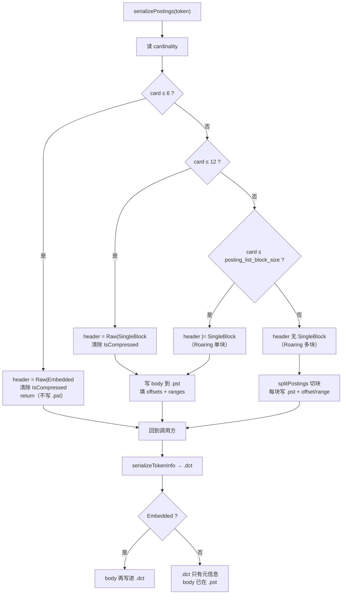

阈值常量：

```cpp
static constexpr UInt64 MAX_CARDINALITY_FOR_EMBEDDED_POSTINGS = 6;
static constexpr UInt64 MAX_CARDINALITY_FOR_RAW_POSTINGS = 12;
// posting_list_block_size 默认 1048576
```

`TokenPostingsInfo` 字段：

| 字段 | 含义 |
|------|------|
| `header` | Flags 位图（Raw / Embedded / SingleBlock / IsCompressed） |
| `cardinality` | 行号个数 |
| `offsets[]` | 每个 posting block 在 **`.pst` 文件**中的偏移（Embedded 时为空） |
| `ranges[]` | 每个 block 的 `[min_row, max_row]`（Embedded 时为空） |
| `embedded_postings` | 仅读路径使用；写路径嵌入时 body 直接追加到 `.dct` |

`serializeTokenInfo` 写进 `.dct` 的内容取决于 header：

```cpp
writeVarUInt(header);
writeVarUInt(cardinality);
if (EmbeddedPostings) return;           // 不写 offset/range；body 紧随其后
if (!(SingleBlock)) writeVarUInt(num_blocks);
for each block:
    writeVarUInt(offset); writeVarUInt(range.begin); writeVarUInt(range.end);
```

---

#### 场景 A：Embedded（card ≤ 6）—— body 进 `.dct`，`.pst` 不写

**示例**：token `api`，行号 `{0, 2}`，card=2。

`serializePostings`：

1. `header = RawPostings | EmbeddedPostings`，清掉 `IsCompressed`
2. **立刻 return**，不碰 `.pst`，`offsets/ranges` 为空

随后：

1. `serializeTokenInfo` → `.dct` 只写 `header` + `cardinality=2`
2. 因 `EmbeddedPostings`，再把 body 写进 **`.dct`**：两个 VarUInt `0`, `2`

```
.dct 中该 token 段：
┌─────────┬──────┬─────┬─────┐
│ header  │ card │  0  │  2  │
│ Raw|Emb │  2   │row  │row  │
└─────────┴──────┴─────┴─────┘
.pst：无此 token 数据
```

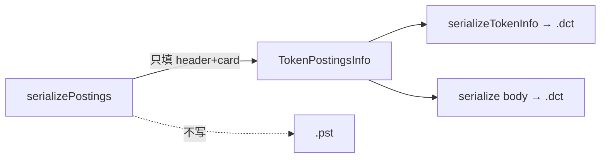

---

#### 场景 B：Raw + SingleBlock（7 ≤ card ≤ 12）—— body 进 `.pst`，`.dct` 只存指针

**示例**：token `batch`，行号 `{1,3,5,7,9,11,13,15}`，card=8。

`serializePostings`：

1. `header = RawPostings | SingleBlock`，清掉 `IsCompressed`
2. 走 `SingleBlock` 分支：
   - `offsets = [当前 .pst 写指针]`（如 `1024`）
   - `ranges = [{1, 15}]`
   - body 写入 **`.pst`**：8 个 VarUInt 行号

随后 `serializeTokenInfo` → `.dct`：

```
header | card=8 | offset=1024 | min=1 | max=15
（SingleBlock → 不写 num_blocks）
```

```
.dct:  [header Raw|Single][8][1024][1][15]     ← 只有元信息
.pst:  ... | VarUInt(1)(3)(5)(7)(9)(11)(13)(15) | ...
              ↑ offset=1024
```

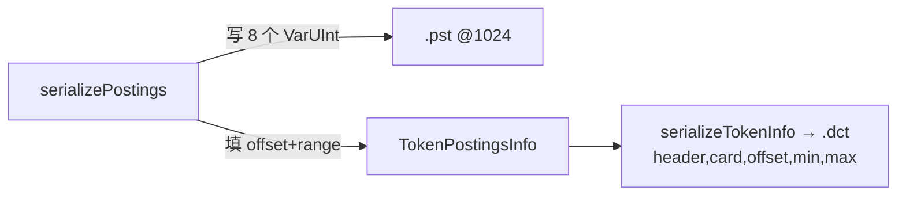

---

#### 场景 C：Roaring 单块（12 < card ≤ posting_list_block_size）—— `.pst` 存 Roaring

**示例**：token `web`，出现在 100 行，card=100，`posting_list_block_size=1MB`。默认 codec=`none`（无 `IsCompressed`）。

`serializePostings`：

1. card>12 且 ≤ block_size → `header |= SingleBlock`（无 Raw）
2. `offsets=[pst_pos]`，`ranges=[{min,max}]`
3. body 写入 `.pst`：`VarUInt(nbytes)` + Roaring portable 字节

`.dct` 仍只写元信息（同场景 B 结构，但 header 无 Raw）：

```
.dct:  [header SingleBlock][100][offset][min][max]
.pst:  [nbytes][Roaring bytes...]
```

读时：按 offset seek `.pst`，读 Roaring，不是 VarUInt 列表。

---

#### 场景 D：Roaring 多块（card > posting_list_block_size）—— 切块写 `.pst`

为便于演示，假设 `posting_list_block_size = 4`（生产默认是 1MB），token `svc` 行号：

```
{0,1,2,3,  10,11,12,13,  20,21}   → card=10，但按 Roaring 容器/阈值切成多块
```

（真实切分按 Roaring 内部 container 累计 cardinality ≥ `posting_list_block_size`；这里用小阈值示意多块形态。）

`serializePostings` 走 else 分支：

```cpp
auto blocks = splitPostings(roaring, posting_list_block_size);
for each block:
    offsets.emplace_back(pst.count());
    ranges.emplace_back(min, max);
    serialize(block → .pst);   // 每块：nbytes + Roaring
```

假设切成 3 块：

| block | rows（示意） | .pst offset | range |
|-------|--------------|-------------|-------|
| 0 | {0,1,2,3} | 2000 | [0,3] |
| 1 | {10,11,12,13} | 2100 | [10,13] |
| 2 | {20,21} | 2200 | [20,21] |

`header` **没有** `SingleBlock`，因此 `serializeTokenInfo` 会多写 `num_blocks`：

```
.dct:
  header（无 SingleBlock）
  card=10
  num_blocks=3
  offset=2000, min=0,  max=3
  offset=2100, min=10, max=13
  offset=2200, min=20, max=21

.pst:
  @2000: roaring_block0
  @2100: roaring_block1
  @2200: roaring_block2
```

查询某行范围时，可用 `ranges` 只读相交的 block（`TokenPostingsInfo::getBlocksToRead`），不必读全部 posting。

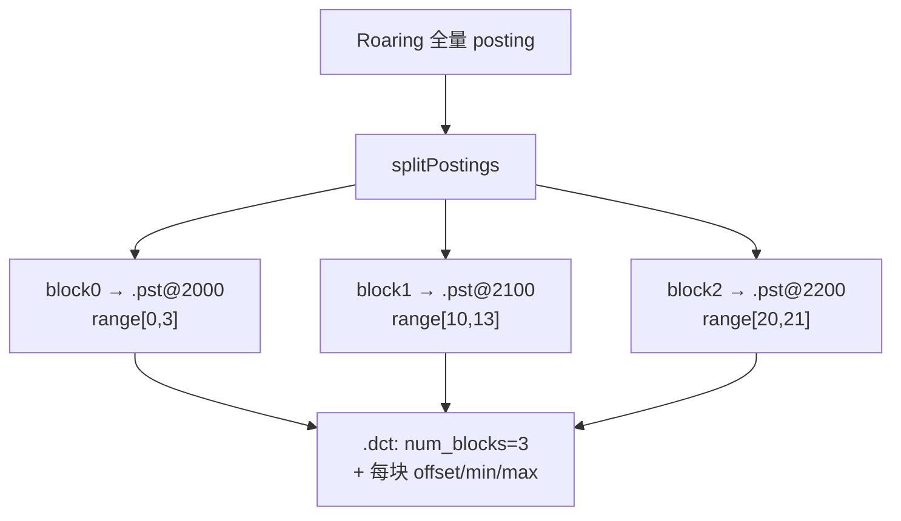

---

#### 场景 E：`IsCompressed`（`posting_list_codec ≠ none`）

若建表指定 `posting_list_codec = 'bitpacking'`（等），且 **不是** Embedded/Raw 小 posting：

1. 开头可能置 `IsCompressed`
2. card≤6 时会 **强制清掉** `IsCompressed`，仍走嵌入（压缩只用于大 posting）
3. 大 posting 走 `posting_list_codec->encode(...)`，由 codec 自己按 `posting_list_block_size` 切段并填充 `offsets/ranges`
4. `.dct` 侧仍通过 `serializeTokenInfo` 写 header（含 `IsCompressed`）+ card + offset/range；body 在 `.pst`

```cpp
// 小 posting 强制不压缩：
if (card <= 6) {
    header |= Raw | Embedded;
    header &= ~IsCompressed;
    return;
}
```

---

#### 四场景对照（默认 codec=`none`）

| 场景 | card | header | body 写到 | `.dct` 写入内容 |
|------|------|--------|-----------|-----------------|
| A Embedded | ≤6 | Raw\|Embedded | **`.dct`**（紧跟 meta） | header + card + **body** |
| B Raw 单块 | 7–12 | Raw\|SingleBlock | **`.pst`**（VarUInt 列表） | header + card + offset + min + max |
| C Roaring 单块 | 13～block_size | SingleBlock | **`.dct` 无 body**；`.pst` 为 Roaring | 同 B（header 无 Raw） |
| D Roaring 多块 | > block_size | （无 SingleBlock） | **`.pst` 多段 Roaring** | header + card + **num_blocks** + 每块 offset/min/max |

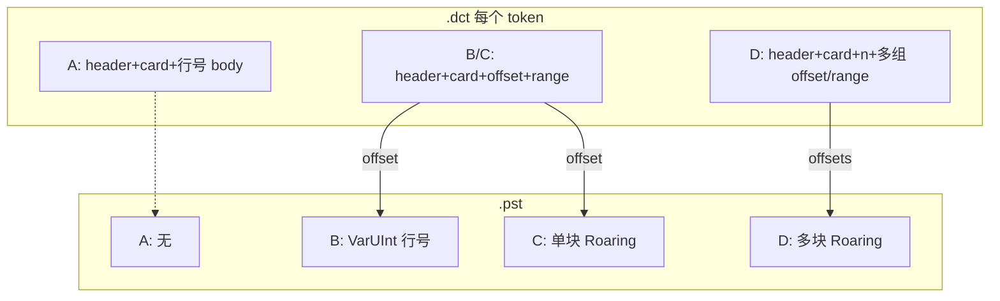

---

#### 和调用顺序的关系（为何 Embedded 分两步）

```cpp
auto token_info = serializePostings(...);   // Embedded：只决策，不写 body
serializeTokenInfo(dct, token_info);        // 先写 header/card
if (Embedded)
    serialize(postings → dct);              // 再写 body，保证 .dct 布局连续
```

非 Embedded 时 body 已在 `serializePostings` 内写入 `.pst`，`serializeTokenInfo` 只把「去哪读」记进 `.dct`。

---

### Step 4：写 `.idx`（稀疏索引）

```cpp
void TextIndexSerialization::serializeSparseIndex(...)
{
    writeVarUInt(version, ostr);           // 版本号
    writeVarUInt(num_blocks, ostr);        // dictionary block 数
    serialize tokens[];                    // 每个 block 的首 token
    serialize offsets_in_file[];           // 对应 .dct 文件偏移
}
```

**本例 `.idx` 内容**：

```
version = 0
num_blocks = 1
tokens = ["api"]          ← 第一个 block 的首 token
offsets = [0]             ← 该 block 在 .dct 中的偏移
```

查询 `has(tags, 'canary')` 时：

1. 在稀疏索引里二分找到 `api` 所在 block（`canary` ≥ `api` 且 < 下一 block 首 token）。
2. 按 offset 读整个 dictionary block。
3. 在 block 内找 `canary` → 读 posting `{3}`。
4. 知道 granule 内第 3 行命中 → 用于裁剪或 Direct Read。

---

## 6. 完整文件布局示意

### 小 posting 场景（本例：全嵌入 .dct）

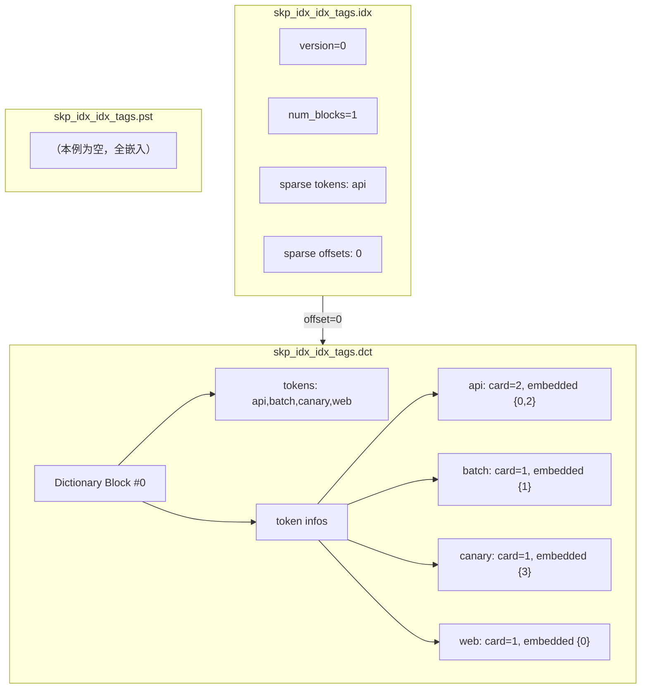

### 大 posting 场景（如 `api` 出现 5000 次）

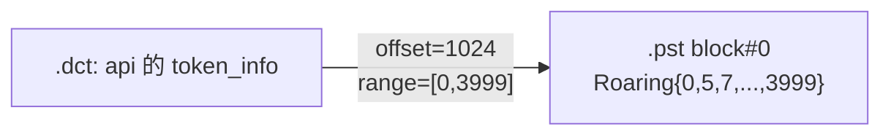

当 posting 超过 `posting_list_block_size`（默认 1MB 行号范围）时，会切成多个 block，每个 block 在 `.dct` 存 offset + min/max row range。

---

## 7. 可调参数

| 参数 | 默认值 | 影响 |
|------|--------|------|
| `tokenizer` | 必填 | 如何分词：`array` / `splitByNonAlpha` / `ngrams` / `sparseGrams` / `splitByString` |
| `preprocessor` | 无 | 写入前先变换列（如 `lower(col)`），不改变 array 维度 |
| `dictionary_block_size` | 512 | 每个 .dct block 最多多少 token |
| `dictionary_block_frontcoding_compression` | 1 | token 用 front-coding 压缩（共享前缀） |
| `posting_list_block_size` | 1048576 (1MB) | 大 posting 按行号范围切 block |
| `posting_list_codec` | `none` | posting 额外压缩 codec |
| `GRANULARITY N` | **对 text 无效**（强制 `100000000`） | 用户写的 N 被忽略；整 part 一份倒排 |
| 表 `index_granularity` | 8192（默认） | 决定 PK mark 大小；查询时按 mark 与 posting 求交裁剪 |

建表示例：

```sql
CREATE TABLE t (
    message String,
    INDEX idx_msg message TYPE text(
        tokenizer = 'splitByNonAlpha',
        dictionary_block_size = 512,
        posting_list_block_size = 1048576,
        preprocessor = lower(message)
    )  -- 可写 GRANULARITY，但对 text 会被强制为 100000000
) ENGINE = MergeTree ORDER BY tuple();
```

---

## 8. 与 minmax / bloom_filter 的对比

| | minmax / bloom_filter | text index |
|--|----------------------|------------|
| 粒度 | 每列 min/max 或概率结构 | **每个 token 的倒排 posting list** |
| 存什么 | 汇总统计 | token 词典 + 行号集合 |
| 文件数 | 1 个 `.idx` | **3 个** `.idx` + `.dct` + `.pst` |
| merge | 通常重建 | **可合并**（`MergeTextIndexesTask`） |
| 查询 | 范围/存在性过滤 | `has()` / `hasAnyTokens()` 等 token 匹配 |
| Direct Read | 不支持 | 支持（`__text_index_*` 虚拟列） |

---

## 9. 验证 SQL

```sql
-- 建表 + 写入
CREATE DATABASE IF NOT EXISTS text_index_demo;
USE text_index_demo;

DROP TABLE IF EXISTS demo;

CREATE TABLE demo (
    id UInt64,
    tags Array(String),
    INDEX idx_tags tags TYPE text(tokenizer = 'array')
) ENGINE = MergeTree
ORDER BY id
SETTINGS index_granularity = 4;

INSERT INTO demo VALUES
(0, ['api','web']),
(1, ['batch']),
(2, ['api']),
(3, ['canary']);

OPTIMIZE TABLE demo FINAL;

-- 看 part 里索引列占用
SELECT
    name,
    column,
    type,
    data_compressed_bytes,
    data_uncompressed_bytes
FROM system.parts_columns
WHERE database = currentDatabase()
  AND table = 'demo'
  AND active
  AND column LIKE 'skp_idx%'
ORDER BY column;

-- 验证索引裁剪
EXPLAIN indexes = 1
SELECT count() FROM demo WHERE has(tags, 'api')
SETTINGS use_skip_indexes_on_data_read = 0;
```

---

## 11. 查询如何用索引定位到 granule

以 `WHERE has(tags, 'api')` 为例，说明从 `.idx → .dct → .pst` 到 **保留/跳过 PK granule（mark）** 的完整路径。

### 11.1 前提：text index granule vs PK granule

| 概念 | 含义 |
|------|------|
| PK granule / mark | 表 `index_granularity` 划出的数据块（如每 4 行一个 mark） |
| Text index granule | **整 part 一份倒排**。`INDEX ... GRANULARITY N` 对 text **无效**，解析时强制为 `100000000`（`DEFAULT_TEXT_INDEX_GRANULARITY`） |
| Posting 行号 | text granule 内行号；因覆盖整 part，等同于 **part 内绝对行号** |

```cpp
// Parsers/ASTIndexDeclaration.cpp
/// Text index is always built for the whole part and granularity is ignored.
if (type && type->name == "text")
    return ASTIndexDeclaration::DEFAULT_TEXT_INDEX_GRANULARITY;  // 100'000'000
```

规划期裁剪（`use_skip_indexes_on_data_read=0`）对 text index 的特殊点（`MergeTreeDataSelectExecutor`）：

1. **只反序列化一次** text index granule（`reader.read(0, ...)`）——因为整 part 只有这一份
2. 对每个 **PK mark** 设置 `current_range = [该 mark 起始行, 结束行]`
3. 用 posting 与 `current_range` 求交，决定是否保留该 mark

因此下面示例用 `index_granularity = 4` + 8 行数据 → **2 个 PK mark**，共用 **同一份** text 倒排；裁剪粒度是 PK mark，不是 text `GRANULARITY`。

### 11.2 示例数据（2 个 PK granule）

```sql
CREATE TABLE demo (
    id UInt64,
    tags Array(String),
    INDEX idx_tags tags TYPE text(tokenizer = 'array')
    -- 即使写 GRANULARITY 1 / 2，实际仍是 100000000（整 part 一份）
) ENGINE = MergeTree
ORDER BY id
SETTINGS index_granularity = 4;

INSERT INTO demo VALUES
-- PK mark 0，行 0..3
(0, ['api','web']),
(1, ['batch']),
(2, ['api']),
(3, ['canary']),
-- PK mark 1，行 4..7
(4, ['web']),
(5, ['api','batch']),
(6, ['canary']),
(7, ['web']);
```

| PK mark | 行号范围 | 含 `api` 的行 |
|---------|----------|---------------|
| mark 0 | [0, 3] | 0, 2 |
| mark 1 | [4, 7] | 5 |

一份 text index granule 覆盖行 0..7，倒排（简化，假设 token 少、全 Embedded）：

| token | posting（行号） | card |
|-------|-----------------|------|
| `api` | {0, 2, 5} | 3 |
| `batch` | {1, 5} | 2 |
| `canary` | {3, 6} | 2 |
| `web` | {0, 4, 7} | 3 |

`.idx`（假设 `dictionary_block_size` 很大，只有 1 个 dictionary block）：

```
sparse: first_token="api", offset_in_dct=0
```

### 11.3 总流程

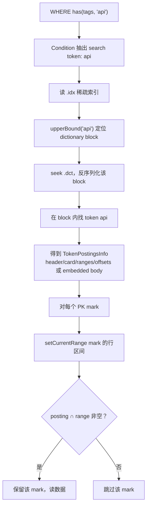

### 11.4 Step-by-step

#### Step 1：解析查询 → search tokens

`MergeTreeIndexConditionText` 把 `has(tags, 'api')` 编成 RPN，得到 search token 集合：`{"api"}`。

#### Step 2：读 `.idx`（稀疏索引）

```cpp
// MergeTreeIndexGranuleText::readSparseIndex
sparse_index = deserializeSparseIndex(.idx);
// tokens = ["api"], offsets_in_file = [0]
```

稀疏索引很小，通常整份读入（可走 header cache）。

#### Step 3：用稀疏索引定位 `.dct` block

```cpp
// analyzeDictionary
idx = sparse_index->upperBound("api");  // 找到第一个 > "api" 的位置
if (idx != 0) --idx;                   // 回退到候选 block
offset = sparse_index->getOffsetInFile(idx);
stream.seekToMark({offset, 0});
block = deserializeDictionaryBlock(.dct);
```

本例只有 1 个 block，`idx=0`，seek 到 `.dct` 偏移 0，读出全部 token + 各自的 `TokenPostingsInfo`。

若有多个 dictionary block（例如首 token 为 `api` / `mmm` / `xxx`）：

```
查 "canary"：
  upperBound("canary") → 落在 first="api" 与 first="mmm" 之间
  → 读 block0（api..），在块内找 canary
```

#### Step 4：取出 `api` 的 TokenPostingsInfo

在 dictionary block 内查找 token：

- 找到 → 放入 `remaining_tokens["api"] = token_info`
- 找不到且是 `hasAllTokens` → 整 granule 直接判否

本例 Embedded：`token_info` 带 `header=Raw|Embedded`，`card=3`，body `{0,2,5}`；反序列化后还会填：

```
ranges = [{0, 5}]    // min..max of posting
offsets = [0]        // embedded 占位；真正 body 已在 info 里
```

若是大 posting（非 Embedded）：`.dct` 只有 `offset → .pst` + `ranges`；需要时再：

```cpp
stream.seekToMark({token_info.offsets[block_idx], 0});  // 跳进 .pst
postings = deserialize(.pst);
```

#### Step 5：按 PK mark 用 posting 裁剪

```cpp
// MergeTreeDataSelectExecutor（text index 分支）
for (mark = 0; mark < num_marks; ++mark) {
    row_begin = getMarkStartingRow(mark);
    row_end   = getMarkStartingRow(mark + 1);
    granule.setCurrentRange({row_begin, row_end - 1});
    if (condition.mayBeTrueOnGranule(granule))
        保留 mark;
}
```

`hasAnyQueryTokens` 核心逻辑：

```cpp
// 1) token 不在 remaining_tokens → 本 mark 无此 token
// 2) token_info.ranges 与 current_range 无交集 → 跳过（粗筛）
// 3) 若已加载 posting（Embedded / SingleBlock rare）：
//      intersection = postings ∩ [row_begin, row_end]
//      非空 → 保留
```

### 11.5 走查两个 mark

**查询**：`has(tags, 'api')`，posting = `{0, 2, 5}`，`ranges ≈ [0, 5]`

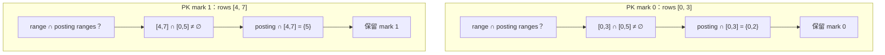

两个 mark 都保留（都含 `api`）。

---

**对比查询**：`has(tags, 'batch')`，posting = `{1, 5}`

| PK mark | current_range | ranges 粗筛 | posting ∩ range | 结果 |
|---------|---------------|-------------|-----------------|------|
| mark 0 | [0, 3] | [0,3]∩[1,5]≠∅ | {1} | **保留** |
| mark 1 | [4, 7] | [4,7]∩[1,5]≠∅ | {5} | **保留** |

---

**对比查询**：`has(tags, 'canary')`，posting = `{3, 6}`

| PK mark | current_range | posting ∩ range | 结果 |
|---------|---------------|-----------------|------|
| mark 0 | [0, 3] | {3} | **保留** |
| mark 1 | [4, 7] | {6} | **保留** |

---

**再造一个「只命中 mark 1」的例子**：假设数据改成只有行 5 有 `api`，posting = `{5}`，`ranges=[5,5]`：

| PK mark | current_range | ranges 粗筛 | posting ∩ range | 结果 |
|---------|---------------|-------------|-----------------|------|
| mark 0 | [0, 3] | [0,3]∩[5,5]=∅ | — | **跳过**（粗筛即可） |
| mark 1 | [4, 7] | 相交 | {5} | **保留** |

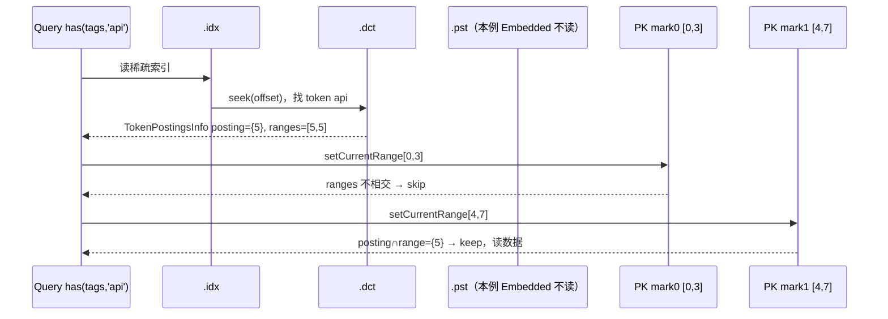

### 11.6 多 dictionary block 时的定位（补充）

假设去重 token 很多，`dictionary_block_size=2`，sorted tokens：`api, batch, canary, web` → 2 个 dct block：

```
.idx:
  [0] first="api",    offset→dct_block0   // tokens: api, batch
  [1] first="canary", offset→dct_block1   // tokens: canary, web
```

查 `web`：

1. `upperBound("web")` → 指向 block1 之后或 block1
2. `--idx` → block1
3. 只读 **dct_block1**，不读 block0
4. 在 block1 找到 `web` → 后续同样按 PK mark 与 posting 求交


### 11.7 读时裁剪 vs 规划期裁剪

| 模式 | 入口 | 行为 |
|------|------|------|
| `use_skip_indexes_on_data_read=0` | `MergeTreeDataSelectExecutor` | 规划期对每个 mark 调 `mayBeTrueOnGranule`，缩小 MarkRanges |
| `=1`（默认） | `MergeTreeReaderTextIndex::canSkipMark` | 读数据时再判断；可配合 Direct Read 填 `__text_index_*` |

两者用的索引信息相同：都是 `.idx → .dct → (可选).pst`，再和 mark 的行范围求交。

### 11.8 小结

| 步骤 | 用到的文件/结构 | 作用 |
|------|-----------------|------|
| 1 | 查询 AST / Condition | 得到 search tokens |
| 2 | `.idx` | 用首 token 定位 dictionary block |
| 3 | `.dct` | 取出 token 的 `TokenPostingsInfo`（小 posting 直接带 body） |
| 4 | `.pst`（若非 Embedded） | 按 `offsets[i]` seek 读 Roaring/Raw 行号 |
| 5 | PK mark 的 `[row_begin, row_end]` | 与 posting / ranges 求交 → 保留或跳过该 granule |

**一句话**：`.idx` 找到词典块，`.dct` 找到 token 元信息（及小 posting），`.pst` 提供大 posting；最后用 **行号集合 ∩ 每个 PK mark 的行区间** 决定读哪些 granule。

---

## 12. 关键源码文件

| 文件 | 职责 |
|------|------|
| `Storages/MergeTree/MergeTreeIndexText.h` | 格式定义、Granule/Aggregator/Builder |
| `Storages/MergeTree/MergeTreeIndexText.cpp` | 序列化/反序列化、分词聚合 |
| `Storages/MergeTree/MergeTreeDataPartWriterOnDisk.cpp` | Part 写入时触发 index 计算 |
| `Storages/MergeTree/MergeTreeReaderTextIndex.cpp` | 查询时读索引、Direct Read |
| `Storages/MergeTree/TextIndexUtils.cpp` | Merge 时合并 text index |
| `Storages/MergeTree/MergeTreeIndicesSerialization.h` | 多 substream 抽象 |
| `Processors/QueryPlan/Optimizations/optimizeDirectReadFromTextIndex.cpp` | Direct Read 优化 |

---

## 13. 一句话总结

Text 索引写入时，对每个 skip index granule 内的行做分词，构建 `token → 行号集合` 的倒排表，然后拆成三层存储：

- **`.idx`**：定位词典块（稀疏索引）
- **`.dct`**：token 词典 + 小 posting 元数据/内嵌 posting
- **`.pst`**：大 posting 的 Roaring Bitmap

查询时：`.idx` 定位词典块 → `.dct` 取 token 元信息 →（可选）`.pst` 读大 posting → 与每个 PK mark 的行区间求交，跳过不相关 granule；Direct Read 模式下可直接从索引返回匹配行。
